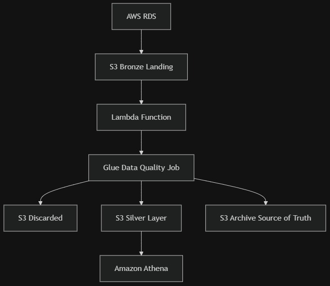

# AWS Data Lake Pipeline (Medallion Architecture)

## Overview

This project implements a **data lake pipeline on AWS** using a Medallion Architecture (Bronze → Silver).  

Data is ingested from **Amazon RDS** into **Amazon S3**, validated using **AWS Glue and Lambda**, and queried using **Amazon Athena** for analytics.

The architecture is fully event-driven and cost-optimized.

---

## Architecture


### Data Flow

1. Data is extracted from **Amazon RDS**
2. A **scheduled AWS Glue job** loads data into:
   - `S3 Bronze Layer (Landing Directory)`
   - Script for first pipeline - [Glue-Pipeline-1](AWS-Project-1/glue_script-pipeline_1.py)
3. An **S3 event trigger** invokes a **Lambda function**
   - Lambda function code - [Lambda function](AWS-Project-1/lambdafunc.py)
5. Lambda calls a **Glue Data Quality Job**
   - Script for second pipeline - [Glue-Pipeline-2](AWS-Project-1/glue_script-pipeline_2.py)
7. Based on validation:
   - Invalid data → `Discarded Folder`
   - Valid data → `Silver Layer (Staging)`
   - Full dataset → `Archive Folder (Source of Truth)`
8. **Amazon Athena** performs analytics on the Silver layer

---

## S3 Folder Structure

```
s3://data-lake-bucket/
│
├── bronze/
│   └── landing/
│
├── silver/
│   └── staging/
│
├── discarded/
│
└── archive/
```

---

## Tech Stack

- **Amazon RDS** – Source database
- **Amazon S3** – Data lake storage
- **AWS Glue** – Data ingestion & validation
- **AWS Lambda** – Event-driven orchestration
- **Amazon Athena** – Serverless analytics
- **IAM** – Secure access control

---

## ⚙️ Key Features

- Medallion Architecture (Bronze → Silver)
- Event-driven processing using S3 triggers
- Automated Data Quality validation
- Separation of bad & valid data
- Archive as immutable source of truth
- Fully serverless (cost efficient)
- Scalable & production-ready design

---

## How It Works

### Scheduled Ingestion
Glue job runs on predefined schedule and loads data from RDS to S3 Bronze layer.

### Event-Based Validation
New files in Bronze trigger Lambda, which invokes a Glue job to:
- Apply data validation rules
- Segregate bad records
- Promote clean data

### Analytics
Athena queries only the Silver layer for reporting and BI dashboards.

---

## Security & Governance

- IAM roles with least privilege access
- S3 bucket policies
- Encryption at rest
- Event-based orchestration for controlled processing

---

## Use Case

Designed for:
- Enterprise data lake architectures
- Batch ingestion pipelines
- Analytics-ready curated datasets
- Scalable cloud-native data platforms

---

## Author

Adarsh Chaudhary  
Data Engineer | AWS | Spark | SQL

---
